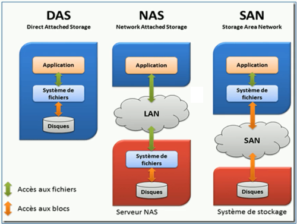

# 磁盘及存储架构

存储设备-磁盘：包括硬盘和软盘。

## 1 磁盘

分为：

* 固态盘：ssd
* 混合盘：sshd
* 机械盘：hdd

### 1.1 磁盘阵列（RAID）

又称为：多磁盘管理技术。

为了不同的目的有多种搭配方式。

## 2 存储架构

操作系统如何连接存储设备。

* 直连式（DAS）
* 网络式（NAS）：所谓的云
* 存储区域网络(SAN)

## 3 文件系统

* 一种**存储**和**组织**数据的方法：使得访问变得容易。
* **文件**和**树形目录**（文件夹）：代替底层数据块的概念。

### 3.1 文件系统分类

* 基于磁盘的文件系统
* 虚拟文件系统：在内核中生成的文件系统，比如proc。
* 网络文件系统：通过网络访问另一台机器的文件系统。

## 4 传统存储的性能瓶颈

1 传统的单机存储的磁盘阵列无法支持**快速**扩容，缩容。

比如在数据多的时候多加几个磁盘扩容，数据少的时候拿掉几个磁盘缩容（对于普通用户来说不了解配置，无法做到快速操作）。

2 像数据多的时候，移动数据明显时间成本大，如何做到移动程序，而不移动数据。

等等。