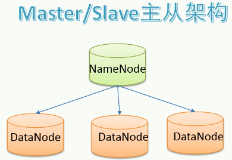
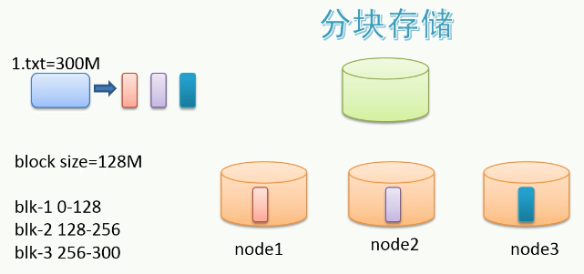
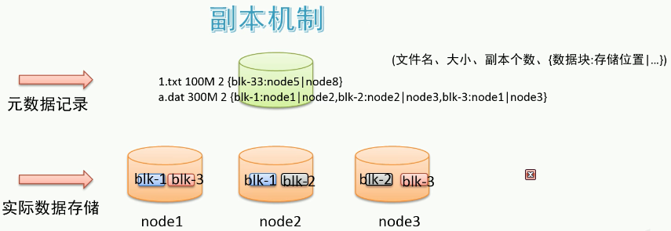
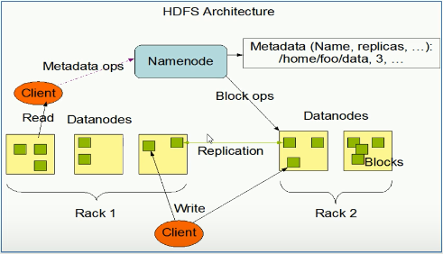

# hadoop分布式文件系统

缩写：HDFS。

## 1 设计目标

* 硬件故障是常态
* 流式读取数据：被设计成用于批处理（一批次一批次的），不追求低延时的用户交互体验。
* 大文件
* write-one-read-many访问模型：数据产生后不再用于修改，只用于分析。
* 移动程序优于移动数据

## 2 主从架构

一主多从。

* namenode是主结点：命名空间，记录目录树，元数据。
* datanode是从结点：真正的文件内数据。

## 3 分块存储

将文件从物理上真的分块(block)了。

块的大小可以通过配置，参数位于`hdfs-default.xml`中的`dfs.blocksize`，hadoop3的默认大小为128MB。

## 4 副本机制

文件的所有block都会有副本。

每个文件的block大小（`dfs.blocksize`）和副本系数（`dfs.replication`）都是可配置的。

副本系数默认是3，即额外复制2份，加本身一共3份。
>副本系数可以在文件创建时指定，也可以之后通过命令改变。

## 5 namespace

层次型文件组织结构，即：文件夹+文件。

namenode主角色负责维护namespace的元数据.

## 6 元数据

两类：

* 文件自身属性信息：文件名称、权限、修改时间、大小等
* 文件块位置映射信息：文件和datanode之间的映射信息，即哪个块位于哪个结点上。

## 7 具体存储

由datanode结点承担，每一个block可在多个节点存储。

>rack机架：放置机器的架子。

