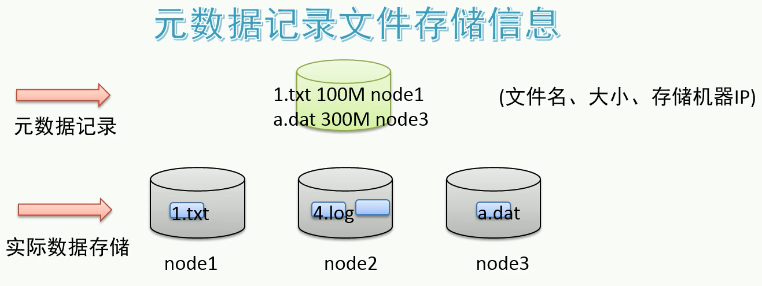
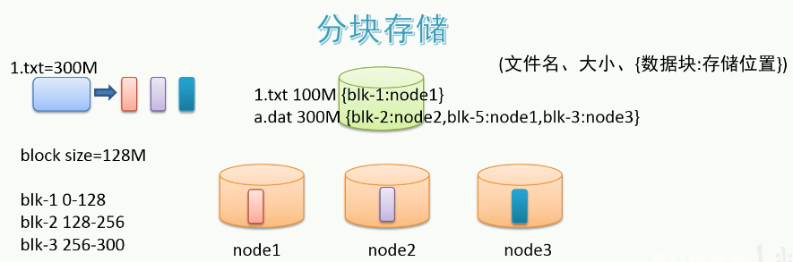
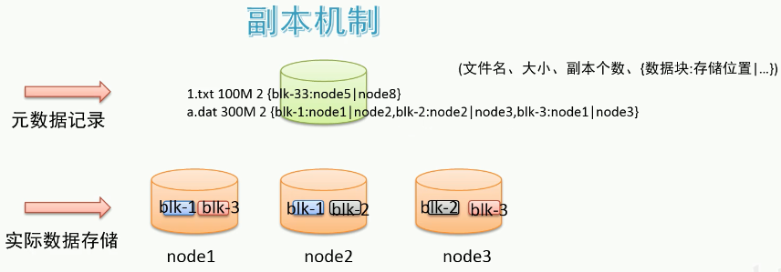
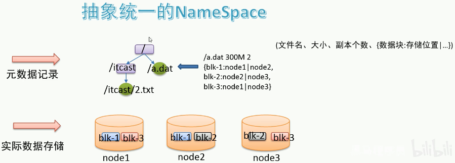

# 模拟分布式文件存储

## 1 海量存储

解决方式：

1. 单机纵向扩展：内存不够加内存，磁盘不够加磁盘，但有上限。
2. 多机横向扩展（**分布式**）：采用多台机器存储，一台不够就加机器，理论无限。

## 2 海量数据文件查询

利用文件**元数据**：记录了文件和其对应的存储位置信息的映射。

专门用一台服务器用来存储元数据。

## 3 大文件传输效率

分块存储：把大文件拆分成若干小文件（block），负载均衡（分割文件平均一些）**分别存储**在不同机器上，并行操作提高效率。

因为分块在不同机器了，所以元数据应该记录得更详细一点：文件分为了几块，分别位于哪些机器上。

## 4 硬件故障->数据丢失

同一份数据，使用不同机器**备份**。

## 5 解决用户查询视角

参考windows的资源管理器的：文件夹+文件

即带有层次感的命名空间（namespace），**抽象目录树结构**。

