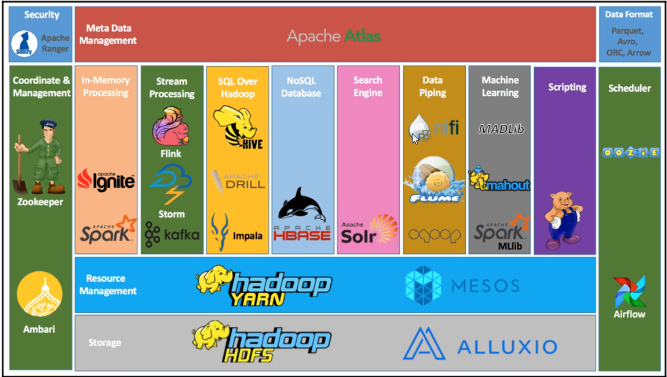

# Hadoop介绍

1. **狭义**: apache的一款开源软件,实质上是提供了一套开源框架/平台,来**存储**和**使用**大数据。

**核心组件**

* Hadoop Distributed File System (HDFS)：分布式文件存储系统，解决海量数据存储。
* Hadoop YARN ：集群资源管理和任务调试框架，解决资源任务调试。
* Hadoop MapReduce：分布式计算框架，解决海量数据计算。

2. **广义**：围绕Hadoop打造的大数据生态圈。

