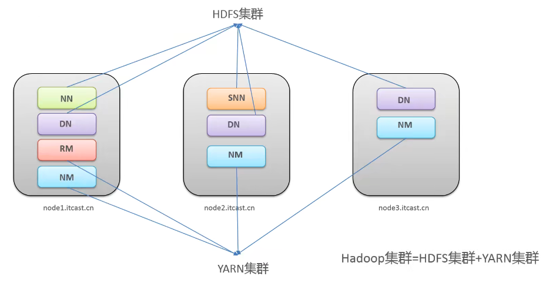

# 安装与集群

## 1 安装

官方提供了：
* 源码包：供具体环境，具体编译
* 默认安装包：通用，但偶尔会提醒缺少环境之类的错误。

## 2 集群架构简介

两个集群都是标准的主从架构集群：
1. HDFS集群（分布式存储）
   * 主角色：NameNode(NN)
   * 从角色：DataNode(DN)
   * 主角色辅助角色：SecondaryNameNode(SNN)
2. YARN集群（资源管理、调度）
   * 主角色：ResourceManager(RM)
   * 从角色：NodeManager(NM)

两个集群逻辑上分离、通常物理上在一起。
>* 逻辑分离：两个集群互相之间没有依赖、互不影响。
>* 物理一起：某些角色进程因为业务需要往往部署在同一台物理服务器上。

Hadoop集群=HDFS集群+YARN集群


>没有MapReduce集群，它只是一段用于计算的代码。

## 3 部署模式

1. standalone mode：单机模式
   1个机器运行1个java进程，所有角色在一个进程中运行，主要用于**调试**
2. pseudo-distributed mode：伪分布模式
   1个机器支行多个进程，每个角色一个进程，主要用于**调试**
3. cluster mode：集群模式
   主要用于**生产环境**部署，会使用N台主机组成一个Hadoop集群，主结点和从结点会分开部署在不同的机器上。
4. HA mode：高可用模式
   在集群模式的基础上为**单点故障**部署备份角色，形成主备架构，实现容错性。

## 4 部署环境

3台机器

1. 确认主机名hostName,
2. 主机映射(hosts文件)：ip在前，主机名在后.
3. 关闭防火墙：内网通信，不需要给每个端口都授予许可，直接关闭防火墙。
   >禁止防火墙自启
4. ssh免密登录：一键启动，关闭
   * node1->node1
   * node1->node2
   * node1->node3
5. 集群时间同步：机器所属时区、时间都一样。
6. jdk安装：卸载linux自带的openJdk，安装自定义的jdk.

## 4 开始部署

### 4.1 集群架构

选择hadoop-3.1.4，搭建如下图所示的集群：


https://www.bilibili.com/video/BV11N411d7Zh?p=16

### 4.2 统一安装工作目录（3台机器）
* mkdir -p /export/server       #软件安装路径
* mkdir -p /export/data         #数据存储路径
* mkdir -p /export/software     #安装包存放路径

### 4.3 配置文件修改

1. hadoop-env.sh
   ```
   cd /export/server/hadoop-3.1.4/etc/hadoop
   vim hadoop-env.sh
   >
   #配置JAVA_HOME
   export JAVA_HOME=/export/server/jdk1.8.0_65
   #设置用户以执行对应角色shell命令
   export HDFS_NAMENODE_USER=root
   export HDFS_DATANODE_USER=root
   export HDFS_SECONDARYNAMENODE_USER=root
   export HDFS_RESOURCEMANAGER_USER=root
   export HDFS_NODEMANAGER_USER=root
   ```

2. core-site.xml
   ```
   cd /export/server/hadoop-3.1.4/etc/hadoop/
   vim core-site.xml
   >
   <configuration>
    <!--默认文件系统的名称，通过URL中schema区分不同文件系统-->
    <!--file://本地文件系统 hdfs://hadoop分布式文件系统 gfs://谷歌-->
    <!--hdfs文件系统访问地址：http://nn...host:8020-->
    <property>
        <name>fs.defaultFS</name>
        <value>hdfs://node1.itcast.cn:8020</value>
    </property>
    <!--hadoop本地数据存储目录format时自动生成-->
    <property>
        <name>hadoop.tmp.dir</name>
        <value>/export/data/hadoop-3.1.4</value>
    </property>
    <!--在web ui访问hdfs使用的用户名-->
    <property>
        <name>hadoop.http.staticuser.user</name>
        <value>root</value>
    </property>
   </configuration>
   ```

3. hdfs-site.xml
   ```
   cd /export/server/hadoop-3.1.4/etc/hadoop
   vim hdfs-site.xml
   >
   <!--设定SNN运行主机和端口-->
   <property>
    <name>dfs.namenode.secondary.http-address</name>
    <value>node2.itcast.cn:9868</value>
   </property>
   ```

4. mapred-site.xml(hadoop3特有错误)
   ```
   cd /export/server/hadoop-3.1.4/etc/hadoop
   vim mapred-site.xml
   >
   <!--mr程序默认运行方式，yarn集群模式,local本地模式-->
   <property>
    <name>mapreduce.framework.name</name>
    <value>yarn</value>
   </property>
   <!--mr app master环境变量-->
   <property>
    <name>yarn.app.mapreduce.am.env</name>
    <value>HADOOP_MAPRED_HOME=${HADOOP_HOME}</value>
   </property>
   <!--mr MapTask环境变量-->
   <property>
    <name>mapreduce.map.env</name>
    <value>HADOOP_MAPRED_HOME=${HADOOP_HOME}</value>
   </property>
   <!--mr ReduceTask环境变量-->
   <property>
    <name>mapreduce.reduce.env</name>
    <value>HADOOP_MAPRED_HOME=${HADOOP_HOME}</value>
   </property>
   ```

5. yarn-site.xml(参考)
   ```
   cd /export/server/hadoop-3.1.4/etc/hadoop
   vim yarn-site.xml
   >
   <!--yarn集群主角色RM运行机器-->
   <property>
    <name>yarn.resourcemanager.hostname</name>
    <value>node1.itcast.cn</value>
   </property>
   <!--NodeManager上运行的附属服务。需配置成mapreduce_shuffle，才可运行MR程序-->
   <property>
    <name>yarn.nodemanager.aux-services</name>
    <value>mapreduce_shuffle</value>
   </property>
   <!--每个容器请求的最小内存资源（以MB为单位）-->
   <property>
    <name>yarn.scheduler.minimum-allocation-mb</name>
    <value>512</value>
   </property>
   <!--每个容器请求的最大内存资源（以MB为单位）-->
   <property>
    <name>yarn.scheduler.maximum-allocation-mb</name>
    <value>2048</value>
   </property>
   <!--容器虚拟内存与物理内存之间的比率-->
   <property>
    <name>yarn.nodemanager.vmem-pmem-ratio</name>
    <value>4</value>
   </property>
   ```

6. workers
   ```
   cd /export/server/hadoop-3.1.4/etc/hadoop
   vim workers
   >
   node1.itcast.cn
   node2.itcast.cn
   node3.itcast.cn
   ```

7. 分发同步安装包到其它机器（上面6步只在node1机器上更改了配置）
   ```
   cd /export/server
   scp -r hadoop-3.1.4 root@node2:/export/server
   scp -r hadoop-3.1.4 root@node3:/export/server
   ```

8. 配置第4步用到的环境变量
   ```
   vim /etc/profile
   export HADOOP_HOME=/export/server/hadoop-3.1.4
   export PATH=$PATH:$HADOOP_HOME/bin:$HADOOP_HOME/sbin
   ##同步到其它机器
   scp /etc/profile root@node2:/etc/profile
   scp /etc/profile root@node3:/etc/profile
   ##重新加载环境变量，验证是否生效（3台机器）
   source /etc/profile
   hadoop #命令行输入，验证环境变量是否生效
   ```